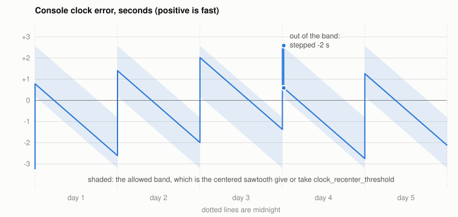

# Keeping the console clock

[weewx-vantagenext manual](https://chaunceygardiner.github.io/weewx-vantagenext/) ·
[weewx-vantagenext on GitHub](https://github.com/chaunceygardiner/weewx-vantagenext) ·
[Report an issue](https://github.com/chaunceygardiner/weewx-vantagenext/issues)

---

The console's clock matters because the console, not the computer, timestamps every archive
record.  And setting it has a price: on the consoles this was measured on, three clock sets
in four were followed by a run of [truncated reads](recovery.md#when-read-errors-happen) —
half a minute of LOOP data lost, typically, and once more than three minutes.  So the aim is a clock that is as right as it can be, set as seldom
as possible.  This page is how the driver does that (2.4), and how to tune it to your
console.

The defaults work.  Tuning is worth doing because consoles differ: of the seven this was
measured on, one nets out to no daily error at all and its clock is never set, while
another gains two thirds of a second a day.

## What a console's clock does

Measured on seven Davis Envoys (the Vantage Pro2 console without a display), over 33 days:

1. **It loses time at a steady rate, all day.**  Between 2 and 3.7 seconds a day, depending
   on the console; the rate does not vary with the hour.  This is `clock_drift_secs`,
   negative for a clock that loses.
2. **At midnight it jumps forward**, by 2 to 4.3 seconds.  This is `day_start_jump`.  The
   jump starts at midnight but is not instantaneous: readings taken four to six seconds
   into the day show 15 to 40 percent of it.  By five past it is complete.  Nothing was
   measured in between, so how long it really takes is not known.
3. **A clock set moves it by a whole number of seconds.**  The command carries hours,
   minutes and seconds and nothing finer, and the console keeps its own sub-second tick
   across it.  Of 40 sets measured, every one moved the clock within 0.08 s of a whole
   number of seconds.  No care over *when* the command is sent can place the clock to a
   fraction of a second.
4. **It reports its time in whole seconds, truncated.**  One reading is therefore low by
   whatever fraction was dropped: anywhere from 0 to 1 second, half a second on average.

The first two make the clock error a **sawtooth**, as tall as `clock_drift_secs`, that no
setting can flatten: a clock that is right at noon is wrong at midnight.  The best on offer
is to *center* it on zero, so that the error runs from half the drift fast, just after the
jump, to half the drift slow, just before the next one.  A console that loses 3.4 seconds a
day can be held within ±1.7 seconds and no better.

The jump and the drift rarely cancel exactly.  What is left over — the **net creep**,
`clock_drift_secs + day_start_jump` — moves the whole sawtooth up or down a little each
day, and that is what eventually calls for a clock set.



The figure is a console that loses 3.39 seconds a day and jumps 4.01: a net creep of +0.62
seconds a day.  On the fourth morning the sawtooth has crept out of the band the driver
allows, and the clock is stepped back two seconds — not to the center, but past it, to the
side the creep comes *from*, so that it is as long as possible before the next step.  Here
that is about three days.

## What the driver does

Each time WeeWX checks the clock (every `clock_check` seconds; see
[Configuration](configuration.md#the-clock-options-and-stdtimesynch)), the driver works out
how far the clock stands from the centered sawtooth for this moment of the day — its
**off-center** distance — and then:

- **Within `clock_recenter_threshold`:** nothing.
- **Beyond it:** the clock is stepped a whole number of seconds toward the side of the band
  the net creep comes from, stopping 0.3 seconds short of that side's own trigger so that
  noise cannot bounce it straight back.  When the net creep is under 0.1 seconds a day
  there is no such side, and the step is to the center.

Because one reading of the console is only good to ±0.5 seconds, a step is decided on a
*measured* error.  The driver polls the console's time until the second changes: the
console's second began between those two readings, so its error is known to within half
the gap between them — a few milliseconds on a serial connection.  The polling takes up to
a second and a half, and it happens only when a precise reading could call for a step.  Once
made, a measurement stands until after the next midnight, because for a console whose options
describe it the distance from center changes only at the jump; the one exception is a single
reading that puts the clock beyond its threshold whatever fraction was dropped, which is
measured at once.  So a console on a serial connection is measured at most about once a day,
and once more after WeeWX restarts.

Some guards, each of which shows up in the log:

- **No unforced step in the first 30 minutes after WeeWX starts, nor within 20 hours of
  the last clock set.**  A console that does not drift and jump as configured then costs one
  set a day at worst rather than one an hour, and a restart loop cannot become a clock-set
  loop.
- **Nothing is decided in the first ten minutes of the day**, while the jump may be half
  done, **nor inside a [time change window](dst.md)**.
- **On a WeatherLinkIP**, where every exchange waits out `tcp_send_delay`, the second
  boundary cannot be found closely enough.  The driver then acts only on an error that is
  beyond the threshold whatever fraction was dropped — half a second further out — and
  steps to the center, so a coarse step can never leave the clock worse than it found it.

WeeWX's `max_drift` remains as a **backstop**.  A clock further out than that — a console
that has lost power, say — is centered at once, at startup included, with none of the
holding off above.  With sensible options it never fires.

## The clock lines in the log

At every check, two lines: the driver's, then WeeWX's.

```
INFO user.vantagenext: Clock is about +0.19 s off center (one reading, good to +-0.5 s; threshold 1.20).
INFO weewx.engine: Clock error is -0.07 seconds (positive is fast)
```

The first is the distance from the *centered sawtooth*; the second is the distance from
the *true time*.  They differ, by design, by up to half of `clock_drift_secs`: just after
midnight a perfectly centered clock is 0 off center and about 1.5 seconds fast.

The `Clock error` WeeWX logs is the true error — corrected for the half second that a
truncated reading drops — and is the error as it stands after any step.

{: .note }
"One reading, good to ±0.5 s" means what it says.  Two checks a moment apart can read
half a second or more apart and both be right, which is most visible at startup, when
WeeWX checks the clock twice within a tenth of a second.  Read the trend over a day, not
the difference between two lines.

When a reading could be beyond the threshold, the driver measures properly, and says either
that nothing was needed:

```
INFO user.vantagenext: Clock is -0.76 s off center (threshold 1.20, measured to 9 ms); not set.
```

or what it did (this is the step in the figure above):

```
INFO user.vantagenext: Clock stepped -2 s: error +2.59 -> +0.59 s, off center +1.26 -> -0.74 s (threshold 1.20, measured to 9 ms) (5280)
```

The step, the true error before and after, the off-center distance before and after, how
precisely the error was measured (`coarse` on a connection too slow to measure), and — the
number at the end — how many LOOP packets the driver had read when it happened.

While a step is being held off:

```
INFO user.vantagenext: Clock is about +1.92 s off center (one reading, good to +-0.5 s; threshold 1.20), but it may not be set for another 17.3 hours (weewx started, or the clock was set, too recently); leaving it alone.  If this repeats, clock_drift_secs and day_start_jump do not describe this console.
```

Once, after a restart, that is nothing.  Every day, it is the driver telling you that its
picture of your console is wrong — which is the next section.

## Tuning it to your console

The log already holds both numbers.  WeeWX writes a `Clock error is ...` line at every clock
check, whatever the driver, and the driver can read them back for you.  Run it with the
Python that runs WeeWX, from the directory that holds the installed `user` directory —
`~/weewx-data/bin` for a pip install, `/etc/weewx/bin` for a package install — and name
the log files, rotated and gzipped ones included:

```
cd ~/weewx-data/bin
~/weewx-venv/bin/python -m user.vantagenext --clock-options /var/log/weewx.log*
```

Name whichever files your WeeWX log goes to (`/var/log/syslog*` on many systems), or pipe
the journal in: `journalctl -u weewx | ~/weewx-venv/bin/python -m user.vantagenext
--clock-options -`.  It only reads the log, so WeeWX can keep running.  Run it on the
station's own machine, or one in the same time zone: it finds midnight by that machine's
clock.  On a machine that runs more than one WeeWX, give it only this station's log: nothing
in a `Clock error` line says which console it came from.  Here is what it said about one
console after a month:

```
830 clock readings, 2026-08-23 to 2026-09-24: 33 days usable, 15 midnights.  WeeWX restarted 103 times and the clock was moved 10 times; each starts the fit afresh.

In the [VantageNext] section of weewx.conf:
    clock_drift_secs = -3.41
    day_start_jump = 4.01

clock_drift_secs is -3.41 +- 0.04; single days varied by 0.15.
day_start_jump is 4.01 +- 0.02; single midnights varied by 0.08.
The clock creeps +0.61 s a day net of its jump.
In [StdTimeSynch], max_drift = 5 (at least |clock_drift_secs| / 2 + clock_recenter_threshold 1.20 + 1.5 = 4.4; WeeWX's default is 5).

The driver last logged clock_drift_secs = -3.39 and day_start_jump = 4.01, which agree.
```

It fits one straight line through every day at once and reads a step off every midnight,
starting afresh wherever the clock was moved or WeeWX restarted (a restart late at night
costs that midnight); a day on which the clocks change is left out.  The `+-` is how well the average is known.  How much single days varied is how much
the console itself wanders — a few hundredths to a couple of tenths — so two decimals are
all the precision the options need.  Aim for a `+-` of about 0.1 or less; if it is larger,
run it again after more quiet days, with no restart of WeeWX and no clock set by hand.  When the values the driver is running with differ
from what the log shows by more than a tenth, the last line says to change them.

It needs at least a day and a half of clock checks, across a midnight, and says so when it
has less.  Set `clock_check = 3600` in `[StdTimeSynch]` if you have not, so there are 24
readings a day to work with.  A log written by the built-in driver serves just as well, so
you can measure a console before switching to this driver.

### Doing it by hand

What `--clock-options` does, done with a handful of readings, is below.  You need a day or
two of hourly `Clock error is ...` lines with no clock set among them (no `Clock set to`
or `Clock stepped` line) and no restart of WeeWX: a restart can shift every reading after it
by up to a second.  Here are real readings from one console, one line in six:

| When | Clock error | | When | Clock error |
|---|---|---|---|---|
| day 1, 01:30 | +1.53 | | day 2, 00:30 | +2.30 |
| day 1, 07:30 | +0.73 | | day 2, 01:30 | +2.18 |
| day 1, 13:30 | −0.13 | | day 2, 07:30 | +1.05 |
| day 1, 19:30 | −0.94 | | day 2, 13:30 | +0.49 |
| day 1, 23:30 | −1.52 | | day 2, 23:30 | −0.91 |

**`clock_drift_secs` is the slope within a day.**  From 01:30 to 23:30 on day 1 the error
went from +1.53 to −1.52: 3.05 seconds lost in 22 hours, which is 3.05 × 24 / 22 = 3.33
seconds a day.  Day 2 gives 3.37.  So `clock_drift_secs = -3.35`.  Use readings as far
apart as the day allows — each one is only good to half a second, and 22 hours of drift
swamps that where two hours would not.

**`day_start_jump` is the step across midnight.**  From 23:30 (−1.52) to 00:30 (+2.30) the
error rose 3.82 seconds, during an hour in which the clock also lost 3.35 / 24 = 0.14.
So the jump was 3.82 + 0.14 = 3.96.  The next midnight gives 4.03; call it
`day_start_jump = 4.0`.

Check the two against each other: their sum, the net creep, should match how much higher
the same hour reads a day later.  Here, +0.65 a day; and 01:30 read +1.53 on day 1 and
+2.18 on day 2.  It does.

A few days more and an average will do better than this — the study behind these numbers
put this console at −3.39 and 4.01 — but values this close are already enough: the driver
measures the clock at every check and decides on what it finds, so a small error in the
options changes when it steps by an hour or two, not whether the clock is kept.

## Choosing `clock_recenter_threshold`

The threshold is a trade between accuracy and clock sets.  The worst error the clock ever
shows is about half of `clock_drift_secs` plus the threshold, and a step buys between
`2 × threshold − 1.3` and `2 × threshold − 0.3` seconds of net creep, depending on where
the whole-second step happened to land.  For the console above, at the default 1.2, that is
a worst case of about 2.9 seconds and a step every two to three and a half days.

The minimum is 0.7: any tighter and a one-second step from just beyond one side could not
land short of the other.  The driver raises a smaller value to 0.7 and says so at startup.

If you change the threshold, check `max_drift` against the rule on the
[Configuration](configuration.md#the-clock-options-and-stdtimesynch) page.

## Setting the clock by hand

```
weectl device --set-time
```

is the forced form: it steps the clock to the center of its sawtooth — not to the computer's
time, which would put it off center — and prints what it did.  That may be nothing:

| It says | Because |
|---|---|
| `Clock stepped -2 s: error +2.59 -> +0.59 s.` | It was set. |
| `Not set: the clock is +0.31 s from the center of its daily drift, and it moves only by whole seconds.` | It is already within half a second of center, and a whole-second step could only make it worse. |
| `Not set: inside a time change transition period.` | See [Daylight-saving time changes](dst.md). |
| `Not set: in the 600 seconds after midnight the console's daily jump may be in progress.` | Try again at ten past. |
