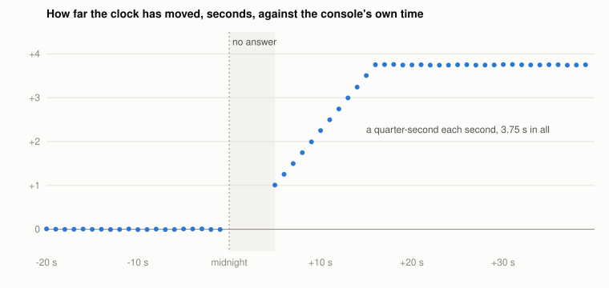
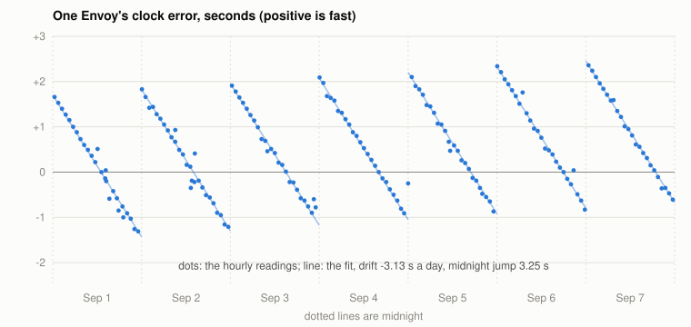
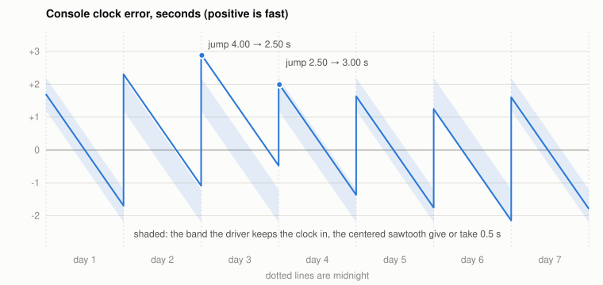

# Keeping the console clock

[weewx-vantagenext manual](https://chaunceygardiner.github.io/weewx-vantagenext/) ·
[weewx-vantagenext on GitHub](https://github.com/chaunceygardiner/weewx-vantagenext) ·
[Report an issue](https://github.com/chaunceygardiner/weewx-vantagenext/issues)

---

The console's clock matters because the console, not the computer, timestamps every archive
record.  Since 3.0 the driver keeps that clock **without setting it**, because every clock set
costs the console about a minute of its transmitter's packets.  It learns how the console's
clock behaves and steers the correction the console already makes to itself every midnight,
which costs nothing.  There is nothing to configure.  Clock steering does not apply to a
WeatherLinkIP: its clock is kept by setting it, as before
([below](#when-the-driver-falls-back-to-setting-the-clock)).

## How a console's clock works

Measured on seven Davis Envoys and a Vantage Pro2 console, two things happen to a console's
clock every day.

**It loses time, steadily, all day.**  Between 2 and 4 seconds a day, depending on the
console, at a rate that does not change with the hour.  This is its **drift**.

**Just after midnight it corrects itself** by its **midnight jump**, a value it keeps in its
own memory (EEPROM address `0x2E`, in quarter-seconds).  The jump is not a step.  Measured
closely on the Vantage Pro2 console: for the first few seconds of the day the console does not
answer at all; then its clock runs fast, a quarter of a second every second, until the jump is
made.  A jump of 3.75 seconds takes about fifteen seconds:



The jump can be negative, and then the clock runs slow the same way, a quarter of a second
every second: measured at −1, −2, −3, −4 and −8 seconds.  The value can be rewritten at any
time, and the console uses the new one at its next midnight.

The jump comes from the factory, different from console to console, and it is the console's
own estimate of its drift: a console that loses 3 seconds a day ought to hold a jump of 3
seconds.  It is never exact, so most consoles gain or lose a little each day even after their
jump.

Together the two make the clock's error a **sawtooth**.  Here is a real Envoy for a week in
which nothing touched its clock:



Each day this console loses 3.13 seconds and each midnight it gains back 3.25, so the whole
sawtooth climbs 0.13 seconds a day.  That leftover — the drift plus the jump — is the
**creep**.  Before 3.0, the creep was what eventually called for a clock set.

**No clock that drifts can be right all day.**  The best on offer is a sawtooth *centered* on
zero, and its two extremes are both at midnight: a console that loses 3 seconds a day runs
from 1.5 seconds fast just after midnight to 1.5 seconds slow just before the next, and is
right only at noon.  How far the clock stands from that centered line is its **off-center**
distance.  It holds all day and changes at midnight by the creep.

Two more things matter to anyone keeping the clock:

- **A clock set moves it by a whole number of seconds.**  The command carries hours, minutes
  and seconds and nothing finer, and the console keeps its own sub-second tick across it.
- **It reports its time in whole seconds, truncated.**  One reading is therefore low by
  whatever fraction was dropped.  Polling until the second changes gives the error to a few
  milliseconds on a serial connection: a **precise** reading.

## What a clock set costs

Every archive record carries `rxCheckPercent`: how many of the ISS's packets the console
received in that interval, against the number it should have.  A sound link runs at 98 to
100 percent, record after record.  On these consoles a low record means one of two things.

### A clock set

**Every clock set costs the console about a minute of its transmitter's packets.**  Of 51
clock sets measured across seven consoles, every one left the archive record it fell in short
of ISS packets: from ten seconds' worth to nearly three minutes', a minute or so typically.
Most of the cost is the command, not the move.  On a spare console, a set to the very time
the console already showed stopped its live data for about 50 seconds, and steps of two to six
seconds for only a little longer, but eight-second steps stopped it for about 100.  The console
lets go of its transmitter and takes a while to find it again, and three sets in four are
followed by a run of [truncated reads](recovery.md#when-read-errors-happen) while it does.

Reading the clock costs nothing measurable, and neither does rewriting the midnight jump.
That is why the driver steers the jump instead of setting the clock.

### Midnight

**About one night in twelve, the console loses its transmitter just after midnight**, for two
to five minutes, occasionally longer.  The record for the first five minutes of the day reads
anywhere from about 60 percent down to almost nothing, with the records either side at 100.
Two years of archives from seven consoles show it on every console, at 7 to 9 percent of
nights each, every month, at a steady rate.  It does not depend on the weather, on the size
of that night's jump, on whether WeeWX was restarted, or on what the other consoles did that
night: each console loses its own nights.  On some of those nights the console also stops
sending LOOP packets two to three minutes into the day.

The driver plays no part in it.  In the first ten minutes of the day it makes no clock
decision, writes no jump and sets nothing — the LOOP stream, the archive downloads and the
time read at a clock check go on as at any other hour — and the loss is the same on a
console whose clock it has never set.  It is the console's own day-rollover work.  Averaged
over every night, it costs about a dozen seconds of reception, and there is nothing to tune.
It is worth knowing about so that one low record at five past midnight is not mistaken for a
failing link.

### How we know the loss is real

`rxCheckPercent` is the console's own count, and a clock set might upset the counting rather
than the reception.  Three things say the packets really are lost:

- **The other consoles heard them.**  Seven consoles at one site listen to the same ISS.  In
  the record where one of them was set, that console comes up short, and the other six, in the
  same five minutes, do not.  It is not the radio and it is not the weather.
- **Nothing else does it.**  Outside clock sets and midnight, only one record on any of the
  seven, in the archives examined, lost as much as a minute — and that was a test program
  fighting the driver for the serial port.
- **The live data stops.**  A spare console was run for days of controlled trials: in each
  five-minute record either nothing was done, or the clock was set, or the midnight jump was
  rewritten.  While the console hears its ISS, the wind in its LOOP packets changes every few
  packets: from any moment, the next change comes about 2 seconds later on average, and even a
  calm night never held it still for longer than half a minute.  After more than 300 clock
  sets the next change took about 55 seconds on average, and a minute or more after two sets
  in five.  After a rewrite of the midnight jump it took about 6 seconds, never once a minute,
  and where nothing was done, the same 2 seconds as always.  The console's own count told the
  same story: 60 to 90 seconds lost per set, 2 or 3 seconds per record otherwise.
- **At midnight, each console loses its own nights.**  On a night one console loses its
  transmitter, the others at the same site, hearing the same ISS, almost always do not.

## What the driver does

**It starts from the console's own estimate.**  The midnight jump the console came with is
its estimate of its drift, so the driver begins by assuming the jump cancels the drift
exactly, and changes nothing while it checks.

**It learns the drift.**  Twice a day — at the first clock check after ten past midnight and
the first after noon — it takes a precise reading, and fits a straight line through the
last 14 days of them, with the jumps and any sets it knows of taken out.  Until its readings
span half a day and a midnight it is **learning**, which takes about a day and a half.

**Then it steers by the jump.**  Once a day, on the reading just after midnight, it works out
where tonight's jump would leave the clock:

- **Within 0.5 seconds of center:** it leaves the jump alone.
- **Further out:** it writes the quarter-second jump that brings the clock back, no more than
  1 second from the jump that would only cancel the drift — anything bigger is the backstop's,
  below.

Two quarter-seconds either side of a console's drift, held in turn, keep it centered for good.
A console whose drift happens to be close to a quarter-second may keep one jump for weeks;
one whose drift falls between two writes every few days.  A console that gains time gets a
negative jump.



The figure is a simulated console that loses 3.39 seconds a day and came with a 4.00-second
jump: a creep of +0.61 seconds a day.  For two days the driver is learning, and the sawtooth
climbs.  Just after the third midnight it writes a jump of 2.50 seconds — a second less than
the drift calls for, to pull the clock back — and from then on the clock stays in the band, the
jump changing only when it needs to.  The clock is never set.

Some guards:

- **Nothing is decided in the first ten minutes of the day**, while the jump may still be in
  progress, **nor in the last minute before it** (a console ahead of the computer begins its
  jump a few seconds early), **nor inside a [time change window](dst.md)**.  No jump is
  written from half past eleven at night until midnight, so a new value never lands as the
  console rolls over.
- **Every jump written is read back**, and the driver reads the console's jump again before
  each day's decision, so it always acts on the jump the console holds.  A write it could not
  confirm — the read-back failed, the console's answer to the write was lost, or WeeWX
  stopped in the moment after it — is checked then: found in the console, it was written, and
  it counts as no failure.  A decision is made only on a jump the driver has read: if the
  console's jump cannot be read, the next clock check tries again.
- **Two writes in a row that fail, or don't read back as written,** and the driver falls
  back to setting the clock (below).
- **A moved clock is found at the next precise reading.**  The console makes the jump it holds,
  every midnight, so the driver can predict each reading from the ones before it.  A reading
  more than 1.5 seconds from that prediction means something moved the clock, and the driver
  starts learning afresh from it.  It is tested against the readings *before* it, so a move
  of two seconds is found even in the first days, when a line drawn through only a few
  readings would bend toward the new one.  Before there is a line at all — the first day
  and a half of learning — each line drawn is asked the same of itself: one that misses
  any of its own readings by more than 1.5 seconds, or says the console drifts more than
  8 seconds a day or jumps outside −8 to +8, holds a move, and learning starts again.  A
  power loss can leave the clock anywhere, seconds or months off; the size makes no
  difference.
- **The decision needs a precise reading.**  The driver decides on the first clock check after
  ten past midnight, and only if it can catch the console's second ticking over to within a
  quarter of a second, which pins the clock to a few milliseconds (a
  [precise reading](#how-a-consoles-clock-works)).  A console slow to answer gives only a
  whole-second reading, good to half a second, too rough to choose a quarter-second jump; the
  driver then waits for the next clock check and tries again.  (A serial or USB console reads
  to a few hundredths of a second, every time, so this is a check that waits, not one that
  gives up.)

**It keeps what it learns** in `vantagenext/clock.json`, in WeeWX's archive directory
(`~/weewx-data/archive/vantagenext/clock.json` for a pip install,
`/var/lib/weewx/vantagenext/clock.json` for a package install).  A restart resumes where it
left off.

## What to expect

- **The clock is never set** in normal running.  Every night's correction is the console's
  own, steered by a value that costs nothing to change.
- **Its error stays within about half the drift of the true time, either way.**  For a console
  that loses 3 seconds a day: about 1.5 seconds fast just after midnight, about 1.5 seconds slow
  just before it, and right around noon.  Steering keeps the sawtooth within half a second of
  center, so the extremes can reach about 2 seconds.  That is the floor for any console that
  drifts, and nothing can do better without setting the clock all day.
- **WeeWX's `Clock error` line will show those extremes**, every night, and that is normal: the
  error is largest on either side of midnight by design.
- **The jump changes now and then**, by a quarter of a second, often settling between two
  values.  Each change is a line in the log.
- **The midnight loss stays.**  About one night in twelve the console still loses its
  transmitter for a few minutes after midnight, on its own.  Steering removes the cost of
  clock sets, not that.
- **The backstop never fires** on a console being steered.  It is there for a console whose
  clock something else has moved.

## When something changes

The driver recovers by itself from anything that changes the console or its clock:

| What happened | What the driver does |
|---|---|
| WeeWX restarted, or the computer rebooted | Resumes from `clock.json` where it left off — including a jump it wrote just before and had not yet confirmed: found in the console, it is taken as written. |
| `clock.json` deleted or lost | Starts learning afresh from the jump the console holds — the best starting point there is.  It costs a day and a half of learning, nothing more. |
| The console replaced by another | Sees a jump in the console other than the one it last held, at startup or at the next daily decision, and learns the console afresh.  If a new console happens to hold the same jump, the first reading the old drift cannot explain does the same (below). |
| The clock moved — a power loss, a set by hand, another program on the cable | A clock off by more than `max_drift` is set at once by [the backstop](#the-backstop).  Then, or for any smaller move, **a reading that the drift cannot explain by 1.5 seconds** shows the clock was moved — or, while the driver is still learning, a line that cannot explain its own readings — and the driver starts learning afresh from that reading.  How far it moved makes no difference: seconds or months. |
| The jump cannot be steered — its memory holds no valid jump, writes fail, or it is a WeatherLinkIP | Falls back to keeping the clock by setting it ([below](#when-the-driver-falls-back-to-setting-the-clock)). |

To make the driver start over yourself — after it has fallen back, say — stop WeeWX, delete
`vantagenext/clock.json` from the archive directory, and start it again.  The console's jump
stays as the driver left it, which is the best starting point there is.

## When the driver falls back to setting the clock

Three things make a console one the driver cannot steer, and it falls back to keeping the
clock by setting it:

- **Its memory does not hold a valid jump** — the two bytes at `0x2E` are not a value and its
  check, or the value is outside −8 to +8 seconds — so the jump is not known.
- **It is a WeatherLinkIP** (`type = ethernet`).  Clock steering does not apply to a
  WeatherLinkIP: its clock is kept by setting it from the first clock check.
- **Writing the jump fails**, or the jump doesn't read back as written, twice in a row.

Falling back is logged: at the first clock check for a WeatherLinkIP or a console with no valid
jump, and as a warning when it happens later; and its reason is logged again each time WeeWX
starts, so a log read after a restart still says why the clock is set.  It lasts until the
console changes, or the state file is deleted; a WeatherLinkIP's lasts until the console is
connected some other way.  The rule is then:

- **Within 1.2 seconds of center:** nothing.
- **Beyond it:** the clock is stepped a whole number of seconds toward the side of the band
  the creep comes from, stopping 0.3 seconds short of that side's own trigger so that noise
  cannot bounce it straight back.  When the net creep is under 0.1 seconds a day there is no
  such side, and the step is to the center.

with these guards: no unforced step in the first 30 minutes after WeeWX starts, nor within 20
hours of the last clock set, so a restart loop cannot become a clock-set loop; and nothing in
the last 60 seconds before midnight or the 600 seconds after it, nor in a time change window.

It goes on learning the console while it does this: it keeps a reading from every clock check,
precise or not, and fits the drift from them — and the midnight jump too, when the console's
memory does not hold one.  A whole-second reading is only good to half a second, but it is off
by much the same amount every time, which moves the fitted line and not its slope, so a few
days of readings, one at every clock check, pin the drift down well.  Until then it assumes the
jump cancels the drift.

## The backstop

WeeWX's `max_drift` remains as a **backstop**.  A clock further out than that — a console that
has lost power, say — is set to the center at once, in any state, and the driver records the
set so its learning stays whole.  With a console it is steering, it never fires.  Leave it at
WeeWX's default of 5: see [Configuration](configuration.md#the-clock-and-stdtimesynch).

## The clock lines in the log

At the first clock check after WeeWX starts, the driver says what it found:

```
INFO user.vantagenext: Clock: the console's midnight jump is 4.00 s; learning its drift.
```

or, resuming:

```
INFO user.vantagenext: Clock: STEERING, midnight jump 3.25 s, drift -3.39 s a day.
```

At every check, two lines: the driver's, then WeeWX's.

```
INFO user.vantagenext: Clock is about +0.19 s off center (one reading, good to +-0.5 s; steering, midnight jump 3.25 s).
INFO weewx.engine: Clock error is -0.07 seconds (positive is fast)
```

The first is the distance from the *centered sawtooth*; the second is the distance from the
*true time*.  They differ, by design, by up to half the drift: just after midnight a perfectly
centered clock is 0 off center and about 1.7 seconds fast.  The `Clock error` WeeWX logs is
corrected for the half second a truncated reading drops.

{: .note }
"One reading, good to ±0.5 s" means what it says.  Two checks a moment apart can read half a
second apart and both be right.  Read the trend over a day, not the difference between two
lines.

When the drift is first learned:

```
INFO user.vantagenext: Clock: drift -3.39 s a day, midnight jump 4.00 s; steering.
```

And once a day, just after midnight, the decision — a jump kept:

```
INFO user.vantagenext: Clock is +0.12 s off center (drift -3.39 s a day); midnight jump 3.25 s kept.
```

or a jump written (this is the first write in the figure above):

```
INFO user.vantagenext: Clock is +1.22 s off center (drift -3.39 s a day); midnight jump 4.00 -> 2.50 s.
```

When something moved the clock:

```
INFO user.vantagenext: Clock: a reading +19.87 s from what the drift predicts: something moved the clock.  Learning its drift afresh from this reading.
```

Or, when it moved while the driver was still learning:

```
INFO user.vantagenext: Clock: no drift fits the readings (one +17.04 s off the line through them): something moved the clock.  Learning its drift afresh from this reading.
```

A console that falls back while running logs a warning that says why and what to delete to
try again; one that starts out falling back — a WeatherLinkIP, or no valid jump — says why
at its first clock check.  The lines it writes after that, and what each means, are on the
[Troubleshooting](troubleshooting.md) page.

## What `weectl device --info` shows

With WeeWX stopped, `weectl device --info` includes the clock:

```
    CONSOLE CLOCK:
      Midnight jump (EEPROM 0x2E):  3.00 s
      Driver's clock state:         STEERING
      Learned drift:                -3.39 s a day
        2026-10-07 00:15  jump 4.00 -> 2.50 (off center +1.22)
        2026-10-08 00:15  jump 2.50 -> 3.00 (off center +0.33)
```

## Setting the clock by hand

```
weectl device --set-time
```

is the forced form: it steps the clock to the center of its sawtooth — not to the computer's
time, which would put it off center — and prints what it did.  That may be nothing:

| It says | Because |
|---|---|
| `Clock stepped -2 s: error +2.59 -> +0.59 s.` | It was set. |
| `Not set: the clock is +0.31 s from the center of its daily drift, and it moves only by whole seconds.` | It is already within half a second of center, and a whole-second step could only make it worse. |
| `Not set: inside a time change transition period.` | See [Daylight-saving time changes](dst.md). |
| `Not set: in the 600 seconds after midnight the console's daily jump may be in progress.` | Try again at ten past. |
| `Not set: in the last 60 seconds before midnight the console's daily jump may be in progress.` | Try again at ten past. |

A console the driver is steering never needs this.  When it is run, it centers the clock on
the drift the driver has learned and records its step in `clock.json`, so the driver carries
on steering as before.  It writes `clock.json` only over the one WeeWX has already saved,
keeping that file's owner and permissions, so running it with `sudo` never leaves WeeWX a file
it cannot replace.  If there is no `clock.json` yet, or it cannot be replaced, the step is not
recorded: when WeeWX next runs, the driver finds the clock moved by something it does not know
of.  Moved more than a second and a half, it learns the drift afresh; moved less, the move is
taken into the drift for a few days and steered back out.
